# Data Cleaning
## Konvertierung der Preise in € nach $
Am 8. Juni 2024 betrug der Wechselkurs von USD zu Euro 0,92.(laut google) Um die Preise in Euro umzurechnen, wurde hier diesen Wechselkurs verwendet. Jede Spalte, die Preise in US-Dollar (mit $ gekennzeichnet) enthielt, wurde mit dem Wechselkurs multipliziert, um die entsprechenden Werte in Euro (mit € gekennzeichnet) zu erhalten. Dabei war es wichtig, auf die korrekte Benennung der Spalten zu achten, insbesondere auf die enthaltenen Leerzeichen. Durch diese Umrechnung könnte es die Preise und Gewinne sowohl in US-Dollar als auch in Euro nachvollziehen und analysieren.

```
# Define the exchange rate from USD to Euro by 8.6.2024
usd_to_euro = 0.92 

# Convert prices from USD to Euro

df[' Unit_Cost_€'] = df[' Unit_Cost_$'] * usd_to_euro
df[' Unit_Price_€ '] = df[' Unit_Price_$ '] * usd_to_euro
df[' Profit_€ '] = df[' Profit_$ '] * usd_to_euro
df[' Cost_€'] = df[' Cost_$'] * usd_to_euro
df['Revenue_€'] = df['Revenue_$'] * usd_to_euro
```


## Methoden zur Ergänzung fehlender Daten
Beim Umgang mit fehlenden Daten in Datensätzen gibt es verschiedene Methoden, um diese zu ersetzen oder zu ergänzen. Jede Methode hat spezifische Vor- und Nachteile und eignet sich besser für bestimmte Arten von Daten oder Analysezielen. 

### Methode 1: Random Replacement

**Erklärung:** Bei dieser Methode werden fehlende Werte durch zufällig ausgewählte Werte aus derselben Spalte ersetzt. Dies kann sinnvoll sein, um die ursprüngliche Verteilung der Daten beizubehalten.

**Einsatzbeispiel:** Wenn Sie eine Spalte mit Kategorien haben (z. B. Farben eines Produkts), und Sie möchten die Verteilung der Kategorien nicht verzerren, können Sie fehlende Werte durch zufällige vorhandene Kategorien aus derselben Spalte ersetzen.

### Methode 2: Fehlende Werte durch Querverweise ergänzen

**Erklärung:** Diese Methode verwendet Informationen aus anderen Spalten (Querverweise), um die fehlenden Werte zu ersetzen. Dies ist nützlich, wenn es eine logische oder statistische Verbindung zwischen den Spalten gibt.

**Einsatzbeispiel:** Wenn in einem Datensatz die Spalte für das Geburtsdatum und das Alter einer Person fehlt, können Sie das fehlende Alter basierend auf dem Geburtsdatum und dem aktuellen Datum ergänzen.

### Methode 3: Fill with zeros

**Erklärung:** Hierbei werden alle fehlenden Werte einer Spalte durch Null ersetzt. Dies ist besonders in numerischen Datenfeldern anwendbar, wo Null einen sinnvollen Wert darstellen kann (z.B. keine Einnahmen, keine Teilnahme).

**Einsatzbeispiel:** In einem Datensatz über Verkäufe könnten fehlende Werte in der Spalte "Anzahl der verkauften Einheiten" mit Null ersetzt werden, was bedeutet, dass keine Verkäufe stattgefunden haben.

### Methode 4: Fill with mean

**Erklärung:** Fehlende Werte werden durch den Mittelwert (Durchschnitt) der vorhandenen Werte in derselben Spalte ersetzt. Dies ist hilfreich, um die zentralen Tendenzen der Daten nicht zu stören.

**Einsatzbeispiel:** In einem Datensatz mit Testergebnissen, wo einige Werte fehlen, kann der Mittelwert der restlichen Noten verwendet werden, um eine realistische Schätzung der fehlenden Werte zu bieten.

### Methode 5: Stratified Replacement

**Erklärung:** Bei dieser Methode werden fehlende Werte basierend auf einer Kategorisierung (Stratifikation) der Daten ersetzt. Dies kann z.B. der Durchschnittswert innerhalb einer bestimmten Kategorie sein.

**Einsatzbeispiel:** In einem Gehaltsdatensatz könnten fehlende Gehälter basierend auf der Abteilung und der Berufsbezeichnung ergänzt werden, indem der Durchschnitt der Gehälter innerhalb jeder spezifischen Gruppe (Stratum) verwendet wird.

---
Die Wahl der Methode hängt stark von der Art der Daten und dem Kontext der Analyse ab. Es ist wichtig, die Implikationen jeder Methode zu verstehen und wie sie die Ergebnisse Ihrer Datenanalyse beeinflussen kann. In der Praxis ist es oft sinnvoll, mehrere Methoden zu testen und ihre Auswirkungen auf die Analyseergebnisse zu vergleichen.

Es gibt fehlende Werte in den folgenden Spalten:

```

Unnamed: 0           0
Sales_Order #        0
Date                 0
Day                  1
Month                0
Year                 0
Customer_Age         6
Customer_Gender      9
Country              0
State                1
Product_Category     1
Sub_Category         1
Order_Quantity       2
Unit_Cost_$         12
Unit_Price_$        12
Profit_$            13
Cost_$              12
Revenue_$           13
Unit_Cost_€         12
Unit_Price_€        12
Profit_€            13
Cost_€              12
Revenue_€           13
```
### Datenbereinigung

Um fehlende Werte in den jeweiligen Spalten abzudecken, wurden folgende Methoden verwendet:
1. Mittelwert (Mean) - für numerische Daten
2. Modus (Mode) - für kategoriale Daten
3. Vorherige/nächste Werte (Forward/Backward Fill) - für Zeitreihendaten


| Column            | Missing Values | Proposed Method            |
|-------------------|:---------------:|----------------------------|
| Day               | 1              | Random Replacement         |
| Customer_Age      | 6              | Random Replacement           |
| Customer_Gender   | 9              | Random Replacement         |
| State             | 1              | Fehlende Werte durch Querverweise ergänzen |
| Product_Category  | 1              | Fehlende Werte durch Querverweise ergänzen |
| Sub_Category      | 1              | Fehlende Werte durch Querverweise ergänzen |
| Order_Quantity    | 2              | Random Replacement             |
| Unit_Cost_$       | 12             | Fill with mean             |
| Unit_Price_$      | 12             | Fill with mean             |
| Profit_$          | 13             | Fill with mean             |
| Cost_$            | 12             | Fill with mean             |
| Revenue_$         | 13             | Fill with mean             |

### Begründung der Methoden:

- **Random Replacement**:
  - **Day, Customer_Age, Customer_Gender, Order_Quantity**: Diese Spalten haben relativ wenige fehlende Werte, und Random Replacement hilft, zufällige Werte einzufügen, um die Verteilung der Daten nicht zu verzerren. Im Fall von `Customer_Age` und `Customer_Gender` kann dies besonders nützlich sein, wenn Durchschnittswerte nicht sinnvoll sind.
  
- **Fehlende Werte durch Querverweise ergänzen**:
  - **State**: Da ein Bundesstaat immer zu einem Land gehört, können fehlende Werte anhand der vorhandenen Länderinformationen ergänzt werden.
  - **Product_Category, Sub_Category**: Da Produktkategorien und Unterkategorien konsistent sein sollten, können fehlende Werte basierend auf anderen vorhandenen Datensätzen ergänzt werden.

- **Fill with mean**:
  - **Unit_Cost_$, Unit_Price_$, Profit_$, Cost_$, Revenue_$**: Diese numerischen Spalten können durch den Mittelwert der vorhandenen Daten ausgefüllt werden, um die fehlenden Werte zu ergänzen, ohne die Gesamtverteilung der Daten wesentlich zu beeinflussen.
---
### Typo finden
 - Es könnte bei Zeichenfolgen vorkommen, daher wurden 'Month', 'Country' und 'State' überprüft.

---

###  Box Plot zur Erkennung von Ausreißern
Das Darstellen von kategorialen Daten in einem Boxplot ist schwierig. Deshalb wurden hier nur numerische Daten mit einem Boxplot dargestellt:

1. **Median (Median)**: Die Linie innerhalb der Box repräsentiert den Median. Dies ist der Mittelwert der Daten und gibt wichtige Informationen darüber, wie die Daten verteilt sind.
2. **Interquartilsabstand (IQR)**: Der obere und untere Rand der Box stellen das dritte Quartil (Q3) und das erste Quartil (Q1) dar. Der IQR wird als Q3 - Q1 berechnet und zeigt, wo die mittleren 50% der Daten liegen.
3. **Minimum und Maximum (Whiskers)**: Die Whiskers der Boxplots repräsentieren in der Regel den Bereich Q1 - 1,5 * IQR und Q3 + 1,5 * IQR. Datenpunkte außerhalb dieses Bereichs werden als potenzielle Ausreißer betrachtet.
4. **Ausreißer (Outliers)**: Punkte außerhalb der Whiskers sind Ausreißer. Diese stellen Werte dar, die deutlich außerhalb des durchschnittlichen Bereichs liegen und helfen, die Verteilung und Anomalien in den Daten zu identifizieren.

---
- Unnamed: 0  
<p align="center">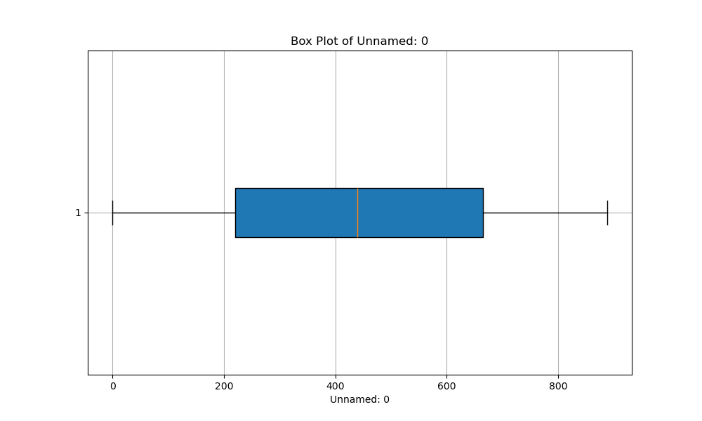</p>

- Sales_Order_#  
<p align="center">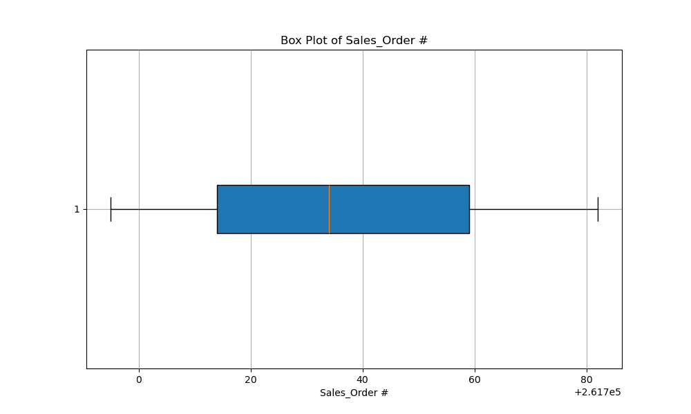</p>

- Day  
<p align="center">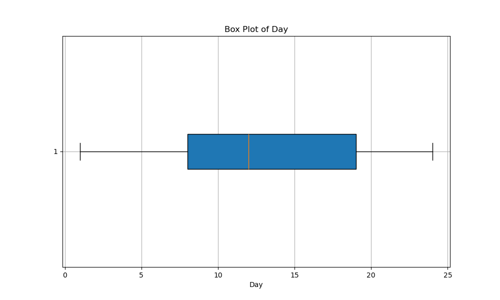</p>

- Year  
<p align="center">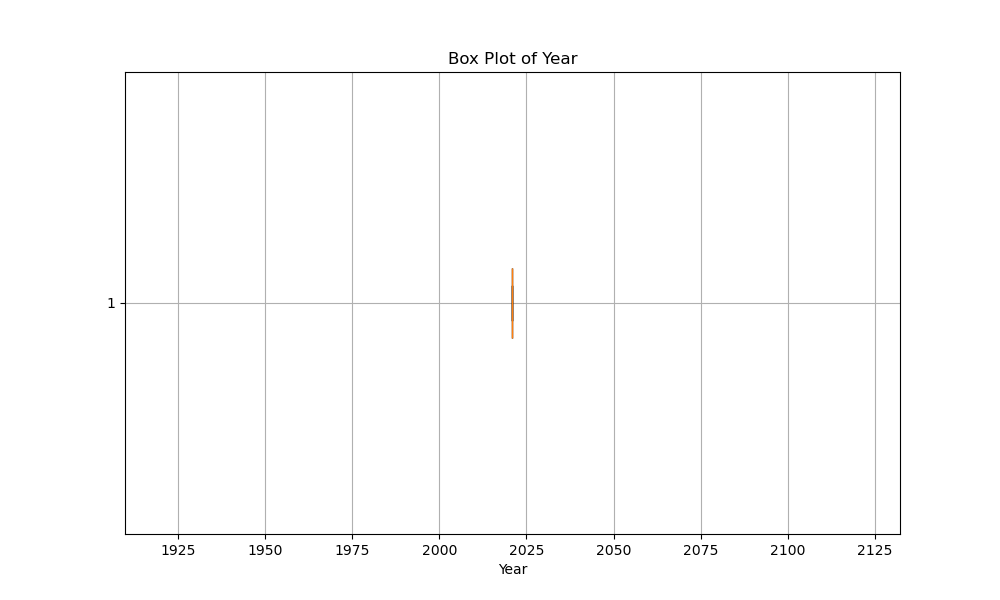</p>

- Customer_Age  
<p align="center">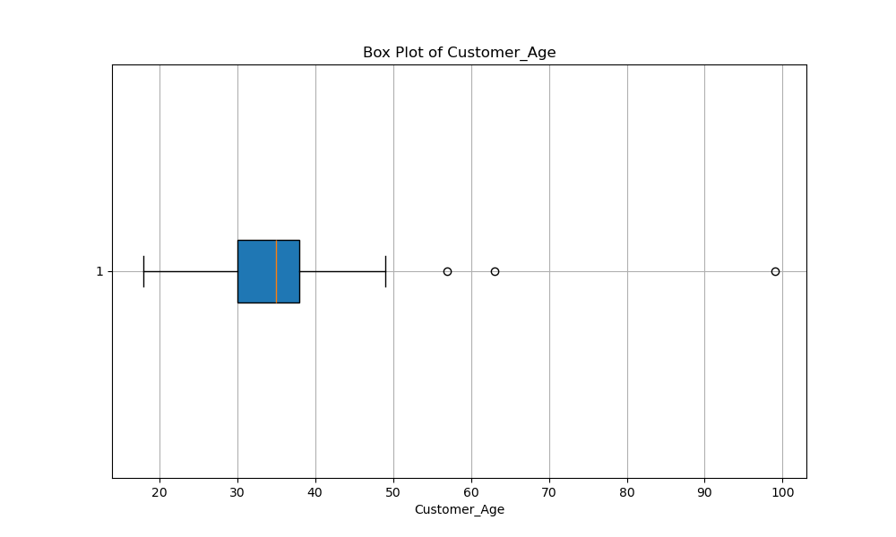</p>

- Order_Quantity  
<p align="center">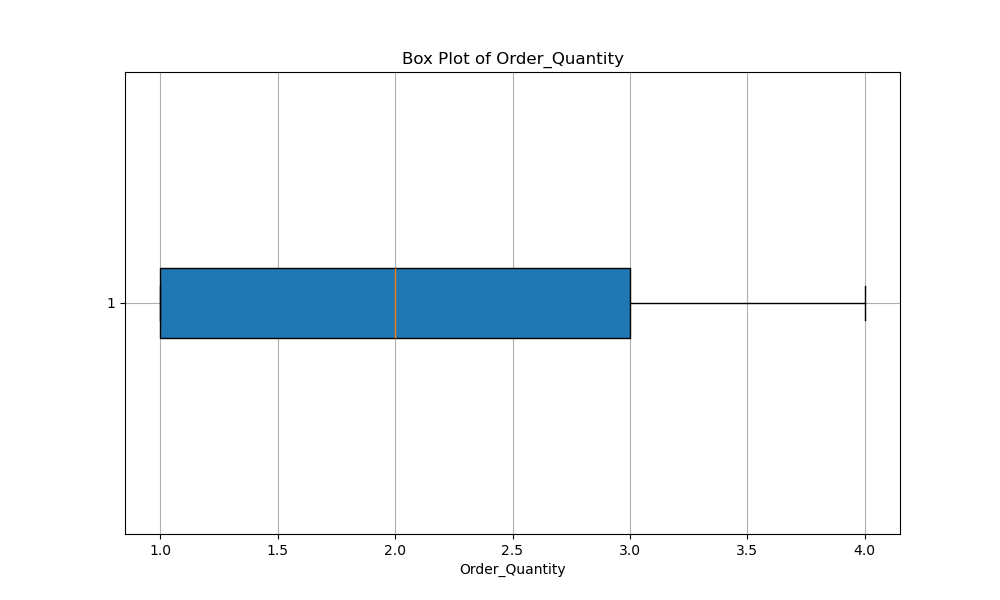</p>

- Unit_Cost_$  
<p align="center">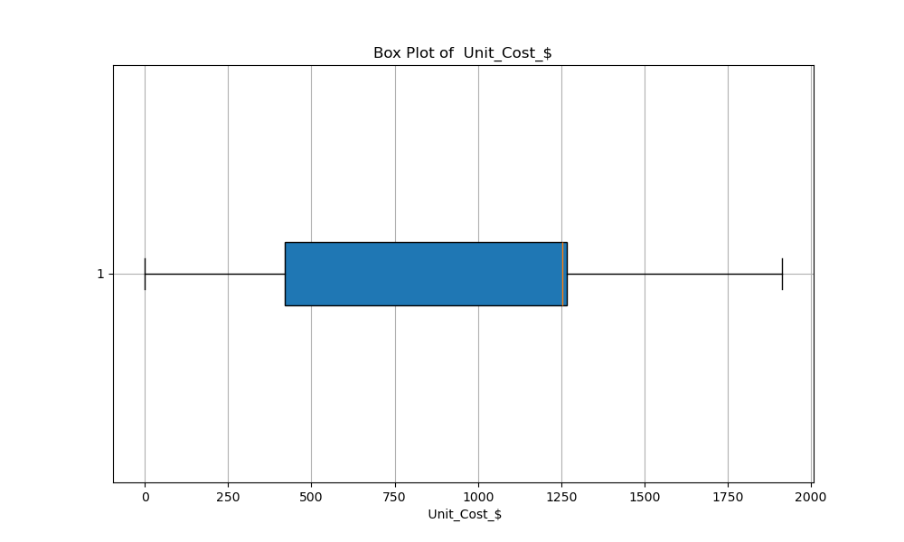</p>

- Unit_Price_$  
<p align="center">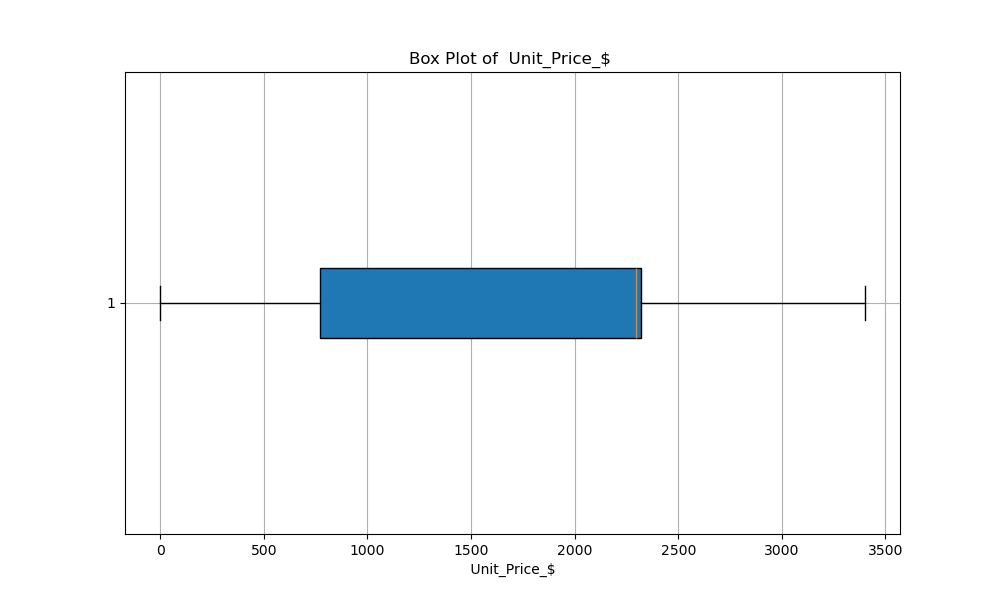</p>

- Profit_$ 
<p align="center"></p>

 - Cost_$  
<p align="center">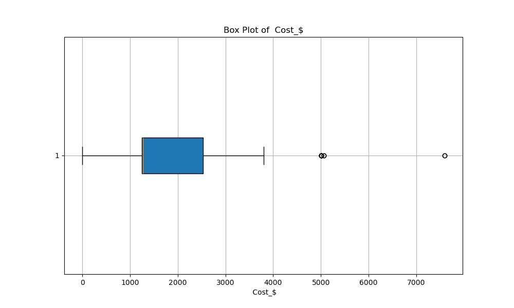</p>

- Revenue_$  
<p align="center"></p>

- Unit_Cost_€ 
<p align="center"></p>

- Unit_Price_€  
<p align="center">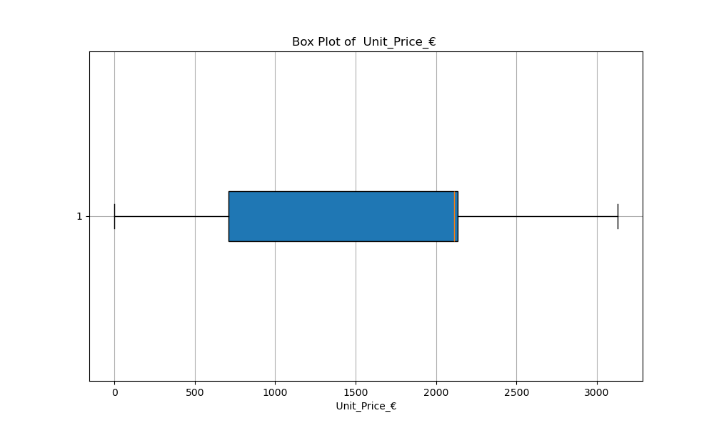</p>

- Cost_€  
<p align="center"></p>

- Revenue_€ 
<p align="center">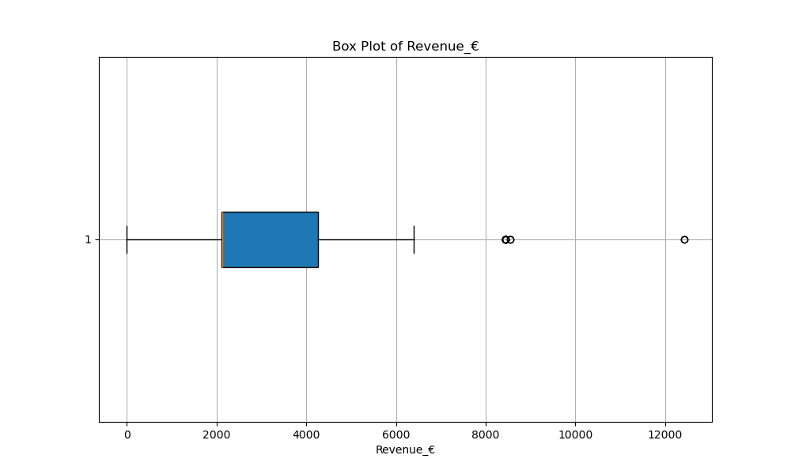</p>

 - Profit_€ 
<p align="center">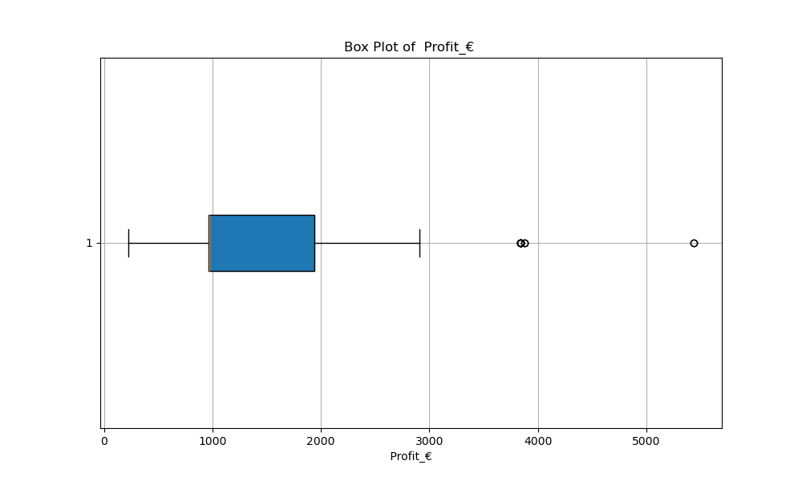</p>

---
### Data Visualization

In dem geeigneten Diagramm wird dargestellt, wie viele Männer und Frauen ein Fahrrad gekauft haben.

 <p align="center">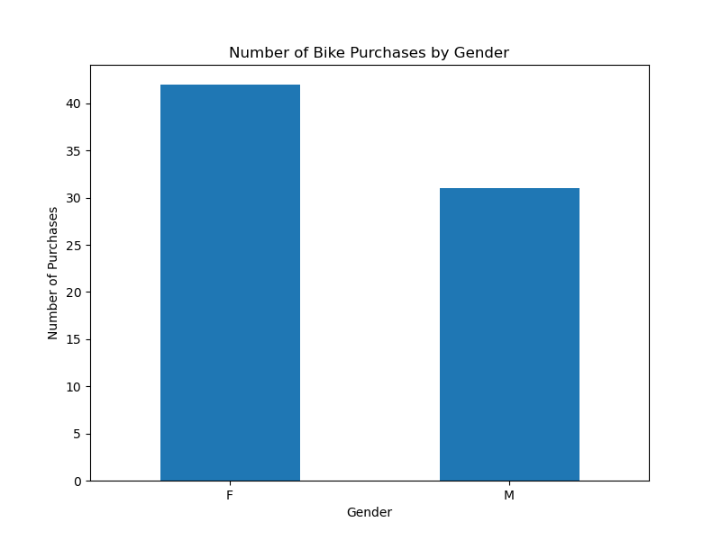</p>

Das folgende Diagramm zeigt den Gewinn pro Land.

 <p align="center">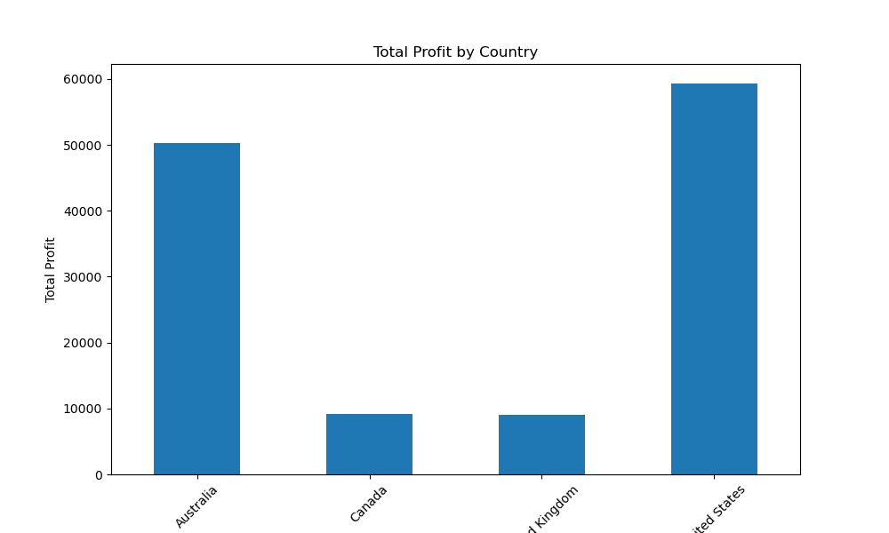</p>

Die Visualisierung unten zeigt, wie viel Geld Frauen und Männer getrennt abhängig von ihrem Alter ausgeben (Kundenalter vs. Umsatz).

 <p align="center">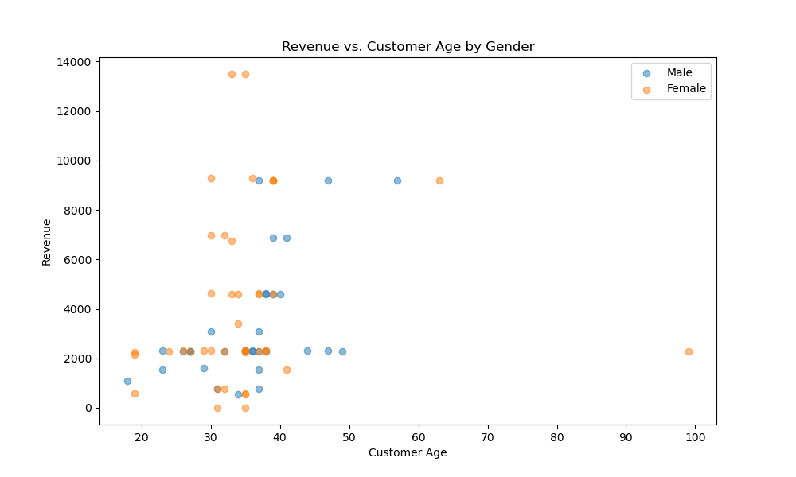</p>

----
### Data Codification
Die folgenden Merkmale waren nicht numerisch: `Monat`,`Customer_Gender`, `Couontry`,`State` , `Product_Catagory`, `Sub_Catagory`. Diese wurden in numerische Merkmale umgewandelt.

Label-Encoding ist eine Methode, bei der jeder Kategorie einer kategorialen Variable eine numerische Zahl zugewiesen wird. Jede Kategorie wird dabei sequenziell durchnummeriert, um die kategorialen Daten in numerische Daten umzuwandeln. Zum Beispiel werden Farbkategorien wie "Rot", "Blau" und "Grün" in die numerischen Werte 0, 1 und 2 umgewandelt.

One-Hot-Encoding ist eine Technik, bei der jede Kategorie einer kategorialen Variable in binärer Form kodiert wird. Dabei werden neue binäre Variablen für jede Kategorie erstellt, wobei die Variable für die entsprechende Kategorie auf 1 und die anderen Variablen auf 0 gesetzt werden. Diese Methode ist nützlich, wenn angenommen wird, dass die Kategorien unabhängig voneinander existieren.

Die Unterschiede zwischen den beiden Techniken sind wie folgt:

Label-Encoding: Da jede Kategorie in eine numerische Zahl umgewandelt wird, kann das Modell Annahmen über die Reihenfolge oder Beziehung dieser Zahlen treffen. Dies ist möglicherweise nicht angemessen, wenn keine eindeutige Reihenfolge vorhanden ist.
One-Hot-Encoding: Jede Kategorie wird in unabhängige binäre Variablen umgewandelt, wodurch das Modell keine Annahmen über die Reihenfolge oder Beziehung der Kategorien trifft.
In der Regel wird One-Hot-Encoding bevorzugt, da es keine Annahmen über die Reihenfolge oder Beziehung der Kategorien trifft und daher flexibler ist. Aus diesem Grund wurde es in diesem Projekt für One-Hot-Encoding entschieden.

----

### Data Reduction
**Korrelationsmatrix erstellen**
Eine Korrelationsmatrix wird erstellt, um die Korrelationen zwischen den verschiedenen Merkmalen in unserem Datensatz zu untersuchen. Hierbei nutzen wir die `corr()`-Funktion von Pandas, die uns die Korrelationskoeffizienten zwischen allen möglichen Paaren von Merkmalen liefert.

**Features mit starker Korrelation entfernen**
Um Multikollinearität zu vermeiden und die Effizienz unserer Analyse zu verbessern, suchen wir nach stark korrelierten Features. Dazu verwenden wir eine Schleife, um durch die Korrelationsmatrix zu iterieren, und identifizieren Features, deren Korrelationskoeffizient über einem bestimmten Schwellenwert liegt (in diesem Fall 0.8). Diese Features werden als stark korreliert betrachtet und entfernt, da sie ähnliche Informationen liefern könnten. Die Entscheidung, Features zu entfernen, basiert auf dem Ziel, die Anzahl der Merkmale zu reduzieren und die Redundanz im Datensatz zu verringern.

**Durchführung der Hauptkomponentenanalyse (PCA)**
Die PCA wird durchgeführt, um die Dimensionalität des Datensatzes zu reduzieren, während gleichzeitig möglichst viel Varianz beibehalten wird. Zunächst standardisieren wir die Daten, um sicherzustellen, dass alle Merkmale die gleiche Skalierung haben. Dann passen wir die PCA an die standardisierten Daten an und berechnen die kumulative erklärte Varianz. Wir bestimmen die Anzahl der Hauptkomponenten, die erforderlich sind, um mindestens 95% der Varianz im Datensatz zu erklären. Diese Anzahl wird verwendet, um die PCA erneut zu passen und die transformierten Hauptkomponenten zu erhalten.

Durch die Durchführung der PCA können wir den Datensatz auf eine kleinere Anzahl von Hauptkomponenten reduzieren, die einen Großteil der Variabilität der Daten erklären. Dies ermöglicht eine effizientere Analyse und Modellierung der Daten.


